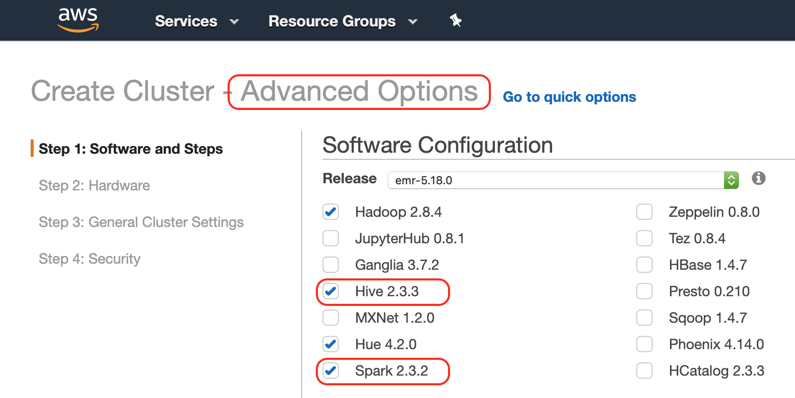
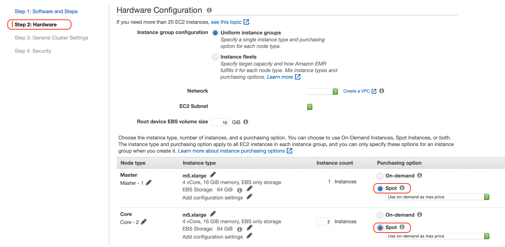
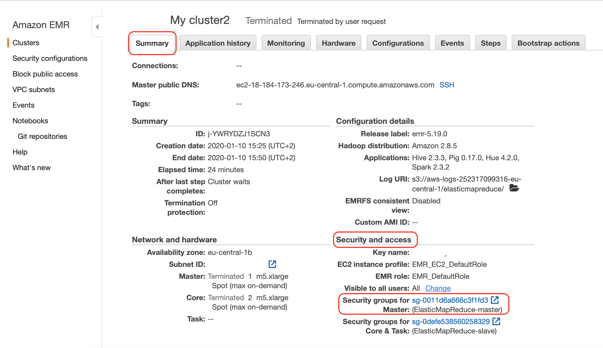
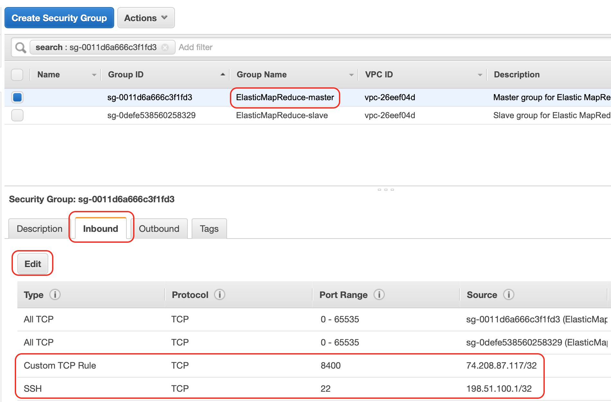

# Howto deploy Lyftron spark driver to AWS EMR cluster.

Requirements:

* AWS account 
* AWS web console with permissions enough to create AWS EMR cluster and EC2 key pair
* scp/sftp and ssh client 

Short roadmap:

* Create and configure AWS EMR cluster
* Upload driver to the cluster
* Start driver

## Create AWS EMR cluster
You have to create AWS EMR cluster to proceed. Use following details while creating

* Software configuration: 
    * use `emr-5.19.0` release, it's latest version with spark 2.3 release
    * ensure both spark and hive are enabled 
* Hardware configuration: pick instance type and number of instances you need. Minimal instance types are m4.large/c4.large.
Use "Advanced options" during EMR creation to choose spot instances  - it may save funds.
* Security and access:
select existing key pair or [create new EC2 key pair](https://docs.aws.amazon.com/AWSEC2/latest/UserGuide/ec2-key-pairs.html#having-ec2-create-your-key-pair) and select it. It allows cluster access with SSH client.

After cluster creation we need to configure Security Groups to permit us to connect to SSH and Lyftron connection:

* click to the created cluster, "Summary" tab 
* under "Security and access" click to the link value of "Security groups for Master"
* in the opened "Security groups" window choose "ElasticMapReduce-master"
* choose "Inbound" tab below and click "Edit" 
* click "Add Rule", select "SSH" as type and "My IP" as Source. Don't forget to use some comment.
* click "Add Rule", select "Custom TCP rule" as type, 8400 as Port Range and custom source `74.208.87.117/32`
* click "Save"

Now we're ready to deploy driver to EMR cluster

## Upload driver to the cluster
* click to the created cluster, "Summary" tab, and pick value of "Master public DNS". That's the endpoint we'll need to connect to via SSH port 22.
* upload content of this directory(not the directory itself) via scp/sftp to remote `/home/hadoop` directory(default directory), 
use `hadoop` as username and endpoint from previous line. You need to specify EC2 key you'd used to create a EMR cluster. Here is `scp` example:
    ```bash
    scp -i emr.key -r spark_driver/* hadoop@ec2-3-120-231-87.eu-central-1.compute.amazonaws.com:
    ``` 
## Start driver
* connect to "Master public DNS" cluster endpoint via ssh client, use port 22, user `hadoop` and EC2 key used during EMR cluster creation. 
Here is `ssh` example:
    ```bash
    ssh -i emr.key hadoop@ec2-3-120-231-87.eu-central-1.compute.amazonaws.com
    ```   
* run `screen` command on the remote terminal to keep driver up and running after ssh disconnect
* check what files do we have in default directory, it should be `/home/hadoop` directory. Here are commands with output example:
    ```bash
    [hadoop@ip-172-31-5-142 ~]$ pwd
    /home/hadoop
    [hadoop@ip-172-31-5-142 ~]$ ls -la
    total 28580
    drwxr-xr-x 6 hadoop hadoop     4096 дек 13 22:47 .
    drwxr-xr-x 4 root   root       4096 дек 13 18:03 ..
    drwxr-xr-x 2 hadoop hadoop     4096 окт 23  2018 .aws
    -rw-r--r-- 1 hadoop hadoop       86 окт 19  2018 .bash_profile
    -rw-r--r-- 1 hadoop hadoop      357 окт 19  2018 .bashrc
    drwxr-xr-x 2 hadoop hadoop     4096 дек 13 18:35 conf
    -rw-rw-r-- 1 hadoop hadoop   193831 дек  5 03:13 hadoop-lzo-0.4.20.jar
    -rwxr-xr-x 1 hadoop hadoop     1523 дек 13 18:35 log4j.properties
    -rwxr-xr-x 1 hadoop hadoop 29009093 дек 13 18:35 lyftron.spark.driver-1.0-spark-2.1.0.jar
    drwxr-xr-x 3 hadoop hadoop     4096 дек 13 18:36 sqljdbc
    drwx------ 2 hadoop hadoop     4096 дек 13 18:04 .ssh
    -rwxr--r-- 1 hadoop hadoop     2183 дек 13 19:33 start-driver.sh
    [hadoop@ip-172-31-5-142 ~]$ 
    ```    
* start the driver via following command:
    ```bash
    bash ./start-driver.sh
    ```
  You should get output like following
  ```bash
  Starting Lyftron driver, cmd arguments: lyftron.driver.port=8400 lyftron.driver.protocol=thrift lyftron.api.key=lyftron-key lyftron.config.path=/home/hadoop/conf/lyftron-site.xml
  Creating app context
  Initializing configuration
  Starting conductor
  ```
* That's it, you're done.
